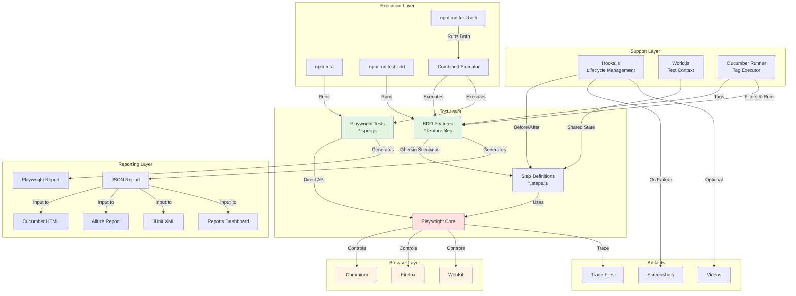
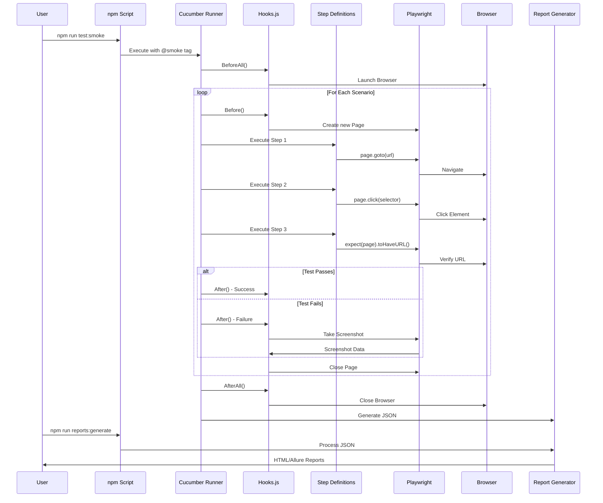

# Playwright + BDD Test Automation Framework

## Overview

This is a comprehensive test automation framework that combines the power of **Playwright** with **Behavior-Driven Development (BDD)** using Cucumber, providing a robust solution for end-to-end testing with multiple reporting capabilities.

---

## 🎭 What is Playwright?

**Playwright** is a modern, open-source automation framework developed by Microsoft that enables reliable end-to-end testing for web applications across all major browsers.

### Key Features:

- **Cross-Browser Testing**: Supports Chromium, Firefox, and WebKit (Safari)
- **Auto-Wait**: Smart waiting mechanism - no need for manual waits
- **Fast & Reliable**: Parallel execution and built-in resilience
- **Modern Architecture**: Supports modern web features like SPA, PWA
- **Multi-Language**: JavaScript, TypeScript, Python, .NET, Java
- **Powerful APIs**: Network interception, geolocation, permissions, and more
- **Debugging Tools**: Time-travel debugging, trace viewer, screenshots, videos

### Why Playwright?

✅ Written by the creators of Puppeteer
✅ Active development and community support
✅ Built for modern web applications
✅ Excellent documentation and tooling
✅ Integrates seamlessly with CI/CD pipelines

---

## 🥒 BDD Framework with Cucumber

While Playwright provides powerful testing capabilities, this framework also includes **Behavior-Driven Development (BDD)** support using **Cucumber**.

### What is BDD?

BDD is a software development approach where tests are written in plain English (Gherkin syntax), making them readable by non-technical stakeholders like business analysts, product owners, and QA teams.

### Why Use BDD with Playwright?

**Benefits:**

- **Business Readable**: Tests written in plain English
- **Collaboration**: Bridge between technical and non-technical teams
- **Living Documentation**: Feature files serve as project documentation
- **Reusability**: Step definitions can be reused across scenarios
- **Tag-Based Execution**: Run specific test suites (@smoke, @regression)

**Example:**

```gherkin
Feature: User Login

  @smoke
  Scenario: Successful login
    Given I navigate to "https://example.com"
    When I enter username "user@test.com"
    And I enter password "password123"
    And I click login button
    Then I should see the dashboard
```

---

## 🔗 Get the Framework

Access the complete framework on GitLab:

**Repository:** [Playwright-BDD-Framework](https://gitlab.com/contactkrvineet/playwright-bdd-framework)

```bash
# Clone the repository
git clone https://gitlab.com/your-username/playwright-bdd-framework.git
cd playwright-bdd-framework
```

---

## 📖 Complete Framework Documentation

### 1️⃣ Getting Started

#### Prerequisites

Before you begin, ensure you have the following installed:

- **Node.js** (v18 or higher) - [Download](https://nodejs.org/)
- **npm** or **yarn** package manager
- **Git** for version control
- **Allure CLI** (optional, for Allure reports) - `brew install allure` (macOS)

#### Installation Steps

**Step 1: Clone the Repository**

```bash
git clone https://gitlab.com/your-username/playwright-bdd-framework.git
cd playwright-bdd-framework
```

**Step 2: Install Dependencies**

This framework requires Playwright and Cucumber packages. All dependencies are listed in `package.json`.

```bash
npm install
```

This will install:

**Playwright:**

- `@playwright/test` - Playwright test runner and library (v1.57.0+)

**Cucumber (BDD):**

- `@cucumber/cucumber` - Core Cucumber framework for BDD (v12.4.0+)
- `@cucumber/pretty-formatter` - Enhanced console output formatting

**Reporting & Utilities:**

- `allure-cucumberjs` - Allure reporting integration for Cucumber
- `allure-playwright` - Allure reporting integration for Playwright
- `cucumber-html-reporter` - Generate HTML reports from Cucumber JSON
- `multiple-cucumber-html-reporter` - Advanced multi-browser HTML reporting

**Step 3: Install Playwright Browsers**

After installing dependencies, download the browser binaries:

```bash
npx playwright install --with-deps
```

This command:

- Downloads Chromium, Firefox, and WebKit browsers
- Installs system dependencies (on Linux)
- Takes ~300MB of disk space

For specific browsers only:

```bash
npx playwright install chromium    # Chrome/Edge only
npx playwright install firefox     # Firefox only
npx playwright install webkit      # Safari only
```

**Step 4: (Optional) Install Allure CLI**

For Allure report generation:

**macOS:**

```bash
brew install allure
```

**Linux:**

```bash
sudo apt-get install allure
```

**Windows:**

```bash
scoop install allure
```

**Step 5: Verify Installation**

Test that everything is set up correctly:

```bash
# Verify Playwright installation
npx playwright --version

# Verify Cucumber installation (dry-run)
npm run test:bdd -- --dry-run

# Run a quick smoke test
npm run test:smoke
```

---

### 2️⃣ Framework Architecture

#### Architecture Diagram



#### Test Execution Flow



#### Directory Structure

```
playwright-bdd-framework/
│
├── features/                        # BDD Test Features
│   ├── sample.feature               # Gherkin scenarios
│   ├── step_definitions/            # Step implementations
│   │   └── sample.steps.js
│   └── support/                     # Test utilities
│       ├── hooks.js                 # Lifecycle hooks
│       └── world.js                 # Test context
│
├── tests/                           # Playwright tests
│   ├── home.spec.js
│   └── hook.spec.js
│
├── reports/                         # Generated reports
│   ├── cucumber-html-report.html
│   ├── cucumber-report.json
│   └── index.html                   # Dashboard
│
├── allure-results/                  # Allure raw data
├── allure-report/                   # Allure HTML report
├── playwright-report/               # Playwright HTML report
│
├── cucumber.config.js               # Cucumber settings
├── cucumber.runner.js               # Tag-based runner
├── playwright.config.js             # Playwright settings
└── package.json                     # Scripts & dependencies
```

---

### 3️⃣ Running Tests

#### Option A: BDD Cucumber Tests

**Run All BDD Tests:**

```bash
npm run test:bdd
```

**Run Tests by Tags:**

```bash
# Smoke tests only
npm run test:smoke

# Regression tests only
npm run test:regression

# Parallel execution
npm run test:smoke:parallel
```

**Custom Tag Combinations:**

```bash
# Multiple tags (AND)
node cucumber.runner.js --tags "@smoke and @regression"

# Multiple tags (OR)
node cucumber.runner.js --tags "@smoke or @critical"

# Exclude tags
node cucumber.runner.js --tags "not @skip"

# With parallel workers
node cucumber.runner.js --tags "@smoke" --parallel 3
```

**Environment Variables:**

```bash
# Run in headed mode (visible browser)
HEADLESS=false npm run test:bdd

# Slow motion (useful for debugging)
SLOWMO=500 npm run test:bdd

# Custom parallel workers
PARALLEL=3 npm run test:bdd:parallel
```

#### Option B: Playwright Tests

**Run All Tests:**

```bash
npm test
# or
npx playwright test
```

**Run Specific File:**

```bash
npx playwright test tests/home.spec.js
```

**Run in Headed Mode:**

```bash
npx playwright test --headed
```

**Debug Mode:**

```bash
npx playwright test --debug
```

**Specific Browser:**

```bash
npx playwright test --project=chromium
npx playwright test --project=firefox
npx playwright test --project=webkit
```

#### Option C: Combined Execution

**Run Both Playwright + BDD:**

```bash
npm run test:both
```

**Run Playwright + Specific BDD Tags:**

```bash
npm run test:both:smoke
```

**Complete Test Suite with Reports:**

```bash
npm run test:all:complete
```

---

### 4️⃣ Generating Reports

This framework generates multiple types of reports for comprehensive test visibility.

**🔗 Live Demo:** [View Sample Reports Dashboard](https://contactkrvineet.github.io/playwright-bdd-framework/reports/index.html)

#### Cucumber Reports

**Generate All Reports:**

```bash
npm run reports:generate
```

**Generated Reports Include:**

- ✅ Multiple Cucumber HTML Report (detailed)
- ✅ Bootstrap-themed Report (modern UI)
- ✅ JSON Report (for integrations)
- ✅ JUnit XML Report (for CI/CD)
- ✅ Reports Dashboard (index.html)

**View Reports:**

```bash
# Open Cucumber report
npm run reports:open

# Or manually open
open reports/cucumber-html-report.html
open reports/index.html
```

#### Allure Reports

**Generate Allure Report:**

```bash
npm run allure:generate
```

**Open Allure Report:**

```bash
npm run allure:open
```

**Quick Serve (Generate + Open):**

```bash
allure serve allure-results
```

#### Playwright Native Report

```bash
npx playwright show-report
```

---

### 5️⃣ Writing Tests

#### Writing BDD Feature Files

**Location:** `features/*.feature`

**Example:**

```gherkin
Feature: Login Functionality

  Background:
    Given I navigate to "https://example.com"

  @smoke @login
  Scenario: Successful login with valid credentials
    When I enter username "user@test.com"
    And I enter password "password123"
    And I click on the "Login" button
    Then I should see the dashboard
    And the URL should contain "dashboard"

  @regression @login
  Scenario Outline: Login with different users
    When I enter username "<username>"
    And I enter password "<password>"
    And I click on the "Login" button
    Then I should see "<message>"

    Examples:
      | username          | password    | message            |
      | user1@test.com    | pass123     | Welcome User1      |
      | user2@test.com    | pass456     | Welcome User2      |
```

#### Writing Step Definitions

**Location:** `features/step_definitions/*.steps.js`

**Example:**

```javascript
const { Given, When, Then } = require("@cucumber/cucumber");
const { expect } = require("@playwright/test");

Given("I navigate to {string}", async function (url) {
  await this.page.goto(url);
});

When("I enter username {string}", async function (username) {
  await this.page.fill("#username", username);
});

When("I enter password {string}", async function (password) {
  await this.page.fill("#password", password);
});

When("I click on the {string} button", async function (buttonText) {
  await this.page.getByRole("button", { name: buttonText }).click();
});

Then("I should see the dashboard", async function () {
  await expect(this.page).toHaveURL(/.*dashboard/);
  await expect(this.page.locator("h1")).toContainText("Dashboard");
});

Then("the URL should contain {string}", async function (urlPart) {
  const url = this.page.url();
  expect(url).toContain(urlPart);
});
```

#### Writing Playwright Tests

**Location:** `tests/*.spec.js`

**Example:**

```javascript
import { test, expect } from "@playwright/test";

test.describe("Login Tests", () => {
  test.beforeEach(async ({ page }) => {
    await page.goto("https://example.com");
  });

  test("successful login", async ({ page }) => {
    await page.fill("#username", "user@test.com");
    await page.fill("#password", "password123");
    await page.click('button[type="submit"]');

    await expect(page).toHaveURL(/.*dashboard/);
    await expect(page.locator("h1")).toContainText("Dashboard");
  });

  test("failed login with invalid credentials", async ({ page }) => {
    await page.fill("#username", "invalid@test.com");
    await page.fill("#password", "wrong");
    await page.click('button[type="submit"]');

    await expect(page.locator(".error")).toBeVisible();
    await expect(page.locator(".error")).toContainText("Invalid credentials");
  });
});
```

---

### 6️⃣ Configuration

#### Cucumber Configuration (`cucumber.config.js`)

```javascript
module.exports = {
  default: {
    require: ["features/step_definitions/**/*.js", "features/support/**/*.js"],
    format: [
      "progress-bar",
      "html:reports/cucumber-html-report.html",
      "json:reports/cucumber-report.json",
      "junit:reports/cucumber-junit-report.xml",
    ],
    publishQuiet: true,
    parallel: process.env.PARALLEL ? parseInt(process.env.PARALLEL) : 1,
  },
};
```

#### Playwright Configuration (`playwright.config.js`)

```javascript
module.exports = {
  testDir: "./tests",
  timeout: 60000,
  fullyParallel: true,
  retries: process.env.CI ? 2 : 0,
  use: {
    headless: true,
    viewport: { width: 1280, height: 720 },
    actionTimeout: 30000,
    navigationTimeout: 30000,
    screenshot: "only-on-failure",
    video: "retain-on-failure",
  },
  projects: [
    { name: "chromium", use: { ...devices["Desktop Chrome"] } },
    { name: "firefox", use: { ...devices["Desktop Firefox"] } },
    { name: "webkit", use: { ...devices["Desktop Safari"] } },
  ],
};
```

#### Hooks Configuration (`features/support/hooks.js`)

**Customize:**

- Browser launch options
- Screenshot settings
- Video recording
- Viewport size
- Slow motion

---

### 7️⃣ Best Practices

#### 1. **Use Descriptive Test Names**

```gherkin
✅ Good: Scenario: User can successfully login with valid credentials
❌ Bad:  Scenario: Login test
```

#### 2. **Tag Your Tests Appropriately**

```gherkin
@smoke     # Critical happy path tests
@regression # Full regression suite
@critical  # High priority
@wip       # Work in progress
@skip      # Temporarily disabled
```

#### 3. **Keep Step Definitions Reusable**

```javascript
// ✅ Good - Reusable
Given("I navigate to {string}", async function (url) {
  await this.page.goto(url);
});

// ❌ Bad - Hardcoded
Given("I navigate to login page", async function () {
  await this.page.goto("https://example.com/login");
});
```

#### 4. **Use Page Objects for Complex Pages**

```javascript
class LoginPage {
  constructor(page) {
    this.page = page;
    this.usernameInput = "#username";
    this.passwordInput = "#password";
    this.loginButton = 'button[type="submit"]';
  }

  async login(username, password) {
    await this.page.fill(this.usernameInput, username);
    await this.page.fill(this.passwordInput, password);
    await this.page.click(this.loginButton);
  }
}
```

#### 5. **Clean Reports Before Important Runs**

```bash
npm run clean
npm run test:bdd
npm run reports:generate
```

---

### 8️⃣ CI/CD Integration

#### GitHub Actions Example

```yaml
name: Playwright Tests

on: [push, pull_request]

jobs:
  test:
    runs-on: ubuntu-latest
    steps:
      - uses: actions/checkout@v4
      - uses: actions/setup-node@v4
        with:
          node-version: 18

      - name: Install dependencies
        run: npm ci

      - name: Install Playwright Browsers
        run: npx playwright install --with-deps

      - name: Run tests
        run: npm run test:both

      - name: Generate reports
        if: always()
        run: npm run reports:generate

      - name: Upload reports
        if: always()
        uses: actions/upload-artifact@v4
        with:
          name: test-reports
          path: |
            reports/
            allure-report/
            playwright-report/
```

#### GitLab CI Example

```yaml
stages:
  - test
  - report

test:
  stage: test
  image: mcr.microsoft.com/playwright:v1.40.0
  script:
    - npm ci
    - npm run test:both
  artifacts:
    when: always
    paths:
      - reports/
      - allure-results/
      - playwright-report/

report:
  stage: report
  script:
    - npm run reports:generate
    - npm run allure:generate
  artifacts:
    paths:
      - reports/
      - allure-report/
```

---

### 9️⃣ Troubleshooting

#### Issue: "Cannot find step definition"

**Solution:**

```bash
# Verify step definitions exist
ls features/step_definitions/

# Run dry-run to check
npm run test:bdd -- --dry-run
```

#### Issue: "Browser not launching"

**Solution:**

```bash
# Reinstall browsers
npx playwright install --with-deps

# Check headless setting
HEADLESS=false npm run test:bdd
```

#### Issue: "Reports not generating"

**Solution:**

```bash
# Ensure tests ran successfully first
npm run test:bdd

# Check JSON file exists
ls reports/cucumber-report.json

# Then generate reports
npm run reports:generate
```

#### Issue: "Allure report not displaying"

**Solution:**

```bash
# Don't open HTML directly, use:
npm run allure:open

# Or serve directly
allure serve allure-results
```

---

### 🔟 Command Reference

| Command                     | Description                     |
| --------------------------- | ------------------------------- |
| `npm test`                  | Run Playwright tests            |
| `npm run test:playwright`   | Run Playwright tests (explicit) |
| `npm run test:bdd`          | Run all BDD tests               |
| `npm run test:smoke`        | Run @smoke tagged tests         |
| `npm run test:regression`   | Run @regression tagged tests    |
| `npm run test:both`         | Run Playwright + BDD tests      |
| `npm run test:both:smoke`   | Run Playwright + @smoke BDD     |
| `npm run test:all:complete` | Run all + generate all reports  |
| `npm run reports:generate`  | Generate Cucumber reports       |
| `npm run reports:open`      | Open Cucumber report            |
| `npm run allure:generate`   | Generate Allure report          |
| `npm run allure:open`       | Open Allure report              |
| `npm run clean`             | Clean all report directories    |

---

## 📚 Additional Resources

- **Playwright Documentation:** https://playwright.dev
- **Cucumber Documentation:** https://cucumber.io/docs
- **Allure Reports:** https://docs.qameta.io/allure/
- **Gherkin Syntax:** https://cucumber.io/docs/gherkin/

---

## 💡 Support & Contribution

For issues, questions, or contributions:

- **GitLab Repository:** [Your Repo Link](https://gitlab.com/your-username/playwright-bdd-framework)
- **Report Issues:** Use GitLab Issues
- **Pull Requests:** Welcome!

---

## 📄 License

ISC License - Free to use and modify

---

**Built with ❤️ using Playwright & Cucumber**
